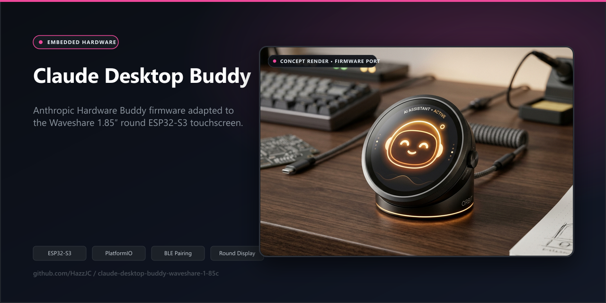

# Claude Desktop Buddy for Waveshare 1.85C

> A desk companion for makers using Claude Desktop developer mode: this firmware adapts Anthropic's Hardware Buddy reference implementation to the **Waveshare ESP32-S3-Touch-LCD-1.85C V2 / Rev2.0**, so an ESP32-S3 can display Claude activity and accept on-device approval decisions over encrypted Bluetooth LE.

> **No photo of this board exists in the repository yet.** `image.jpg` (inherited from before the 1.85C port existed) shows a different, square AMOLED board running an earlier contributor's own build — not the round Waveshare 1.85C V2 target this fork now compiles for. It is kept only as project history and must not be read as evidence this firmware runs on real 1.85C hardware. See [Hardware validation](#hardware-validation).


*Hardware concept render and firmware architecture for the Waveshare ESP32-S3 round touchscreen.*

This is a **single-board fork**, not a general Hardware Buddy distribution. It retains the upstream Nordic UART Service protocol, pairing flow, and desktop Hardware Buddy integration while replacing the prior hardware layer for the round 1.85C board.

## At a glance

| Item | Evidence-backed status |
| --- | --- |
| Target | Waveshare ESP32-S3-Touch-LCD-1.85C V2 / Rev2.0 only |
| Desktop integration | Claude Desktop developer-mode Hardware Buddy flow; protocol documented in [REFERENCE.md](REFERENCE.md) |
| Visual evidence of *this* board running this firmware | **None in the repo.** `image.jpg` is an older, unrelated board photo — see the note above. |
| Firmware build | A no-device PlatformIO compile workflow is included in [`.github/workflows/firmware-build.yml`](.github/workflows/firmware-build.yml). As of this writing it has **not yet produced a run** on GitHub Actions (0 recorded runs) — it will run for the first time when this documentation is opened as a pull request. Confirm it passes before treating the build as verified. |
| Local verification for this documentation update | **Not run**: PlatformIO was not installed in the local workspace; no board was connected. |
| Physical-device verification | **Not claimed**. Use the checklist in [Hardware validation](#hardware-validation) after flashing a real V2 board. |

There is no hosted demo: the useful artefact is the firmware running on the specified physical board.

## What changed for this board

The port is deliberately more than a board name or pin remap. It replaces the target selection with one 1.85C environment and adds a board capability header, then uses those capabilities to route the shared firmware to the correct display, input, power, audio, RTC, and BLE paths.

| Constraint on the 1.85C V2 | Implementation decision |
| --- | --- |
| 360 × 360 **round** ST77916 QSPI panel | Render a 300 × 300 logical canvas into a full physical framebuffer, centred with a 40 px safe inset; draw the attention alert as a circular border rather than relying on corner UI. See [`src/hw/display.cpp`](src/hw/display.cpp). |
| CST816 touch at I2C `0x15` | Use an interrupt-assisted CST816 reader and map physical coordinates back to the logical canvas, including the user-selected UI rotation. See [`src/hw/input.cpp`](src/hw/input.cpp). |
| BOOT is GPIO0; the side control is a latching GPIO6 slide switch | BOOT is the primary action; the side switch is secondary and must be returned before it can be used again. The reset control is a hardware reset line, not a firmware input. |
| LCD and touch reset are behind a TCA9554 I/O expander | Initialise the expander and pulse both reset lines before display/input setup. See [`src/hw/expander.cpp`](src/hw/expander.cpp). |
| The target does not use the AXP2101 path | Compile that path out for this board. The current firmware consequently does not provide board-specific battery/USB telemetry; do not treat battery-dependent screen behaviour as verified. |
| Claude activity may contain sensitive transcript snippets or tool hints | Require LE Secure Connections with MITM bonding and display a six-digit passkey on the device. See [`src/ble_bridge.cpp`](src/ble_bridge.cpp). |

For a traceable change inventory, including the exact baseline and commit range inspected, see [the upstream contribution delta](docs/UPSTREAM_DELTA.md). It is preparation for an upstream discussion, **not** an upstream submission.

### Codebase provenance — what is original here versus inherited

Being precise about authorship matters more than the line-count of the diff, so here is the honest breakdown by commit history:

- **Anthropic** wrote the original `claude-desktop-buddy` (initial commit `8ac960d`): the BLE protocol, desktop pairing flow, ASCII/GIF buddy system, and the reference M5StickCPlus hardware layer.
- **Yadong Xie**, with contributions from `eMUQI` and `Wulu`, then authored roughly 100 commits porting that reference implementation to four *different*, AMOLED-screen Waveshare boards (1.8″, 1.75C, and 2.16″ on both ESP32-S3 and ESP32-C6). That work — none of which targets the round 1.85C LCD board this fork now ships — is what built the `src/boards/` capability-flag dispatcher, the `src/hw/` hardware-abstraction split, and the TCA9554/PMU/IMU plumbing this fork's port reuses. **This is not this author's work**, and the README previously did not make that distinction clearly enough.
- **This author's (HazzJC) own commits** are `a278ba4` (the 1.85C V2 port itself), `9824938` (Bluetooth always-discoverable fix), and `2975a99` (guided demo and interaction wake hold) — three commits, 1,524 insertions and 1,132 deletions across 26 files. That single port commit deleted the four AMOLED board headers Yadong Xie had added, wrote the new `board_waveshare_esp32s3_touch_lcd_1_85c_v2.h`, swapped the display driver from `Arduino_CO5300`/SH8601 (AMOLED) to `Arduino_ST77916` (this board's QSPI round LCD), remapped touch from FT3168 to CST816, and reworked `src/hw/display.cpp`, `src/hw/input.cpp`, `src/hw/expander.cpp`, and `platformio.ini` accordingly. It is a genuine, board-specific port — but it stands on an existing multi-board framework it did not create.

In short: the *pattern* (board dispatcher + capability flags + hw abstraction) is inherited from prior contributors' work on other boards; the *round-display ST77916/CST816 1.85C implementation inside that pattern* is this author's own.

## Architecture

```text
Claude Desktop (developer mode)
        |  encrypted BLE Nordic UART Service; newline-delimited JSON
        v
ble_bridge.cpp  <->  data.h / main.cpp state and UI routing
        |                         |
        |                         +-- ASCII buddies or streamed GIF characters
        v
hardware abstraction layer (src/hw/)
        |-- ST77916 QSPI display + PWM backlight
        |-- CST816 touch + GPIO0 BOOT + GPIO6 side switch
        |-- TCA9554 reset expander, PCF85063 RTC, ES8311 audio
        v
Waveshare ESP32-S3-Touch-LCD-1.85C V2
```

The desktop sends snapshots, permission prompts, optional usage data, time, owner information, and character-pack transfers. The device sends status and permission/question responses. `REFERENCE.md` defines the protocol surface; the board layer is the local adaptation.

## Build and flash

Install [PlatformIO Core](https://docs.platformio.org/en/latest/core/installation/), connect the intended board by USB, then compile:

```bash
pio run -e waveshare-esp32s3-touch-lcd-1-85c-v2
```

Upload only after the compile succeeds and the connected device has been identified as the target board:

```bash
pio run -e waveshare-esp32s3-touch-lcd-1-85c-v2 -t upload
```

If the device contains unrelated firmware, erase it before uploading:

```bash
pio run -e waveshare-esp32s3-touch-lcd-1-85c-v2 -t erase
pio run -e waveshare-esp32s3-touch-lcd-1-85c-v2 -t upload
```

`LittleFS` may format itself on first boot when its partition is empty or belongs to different firmware. That can remove stored character files; it is expected behaviour, not a recovery process for arbitrary data.

## Pair and use

1. In Claude Desktop, enable **Help → Troubleshooting → Enable Developer Mode**.
2. Open **Developer → Open Hardware Buddy…**, choose **Connect**, then select the advertised `Claude-XXXX` device.
3. Type the six-digit code shown on the board into the desktop pairing prompt.

The firmware exposes the same protocol family as the upstream reference implementation. The desktop feature is developer-only and is not represented here as a supported Anthropic product feature.

### Controls

| Control | Normal view | Approval/question view |
| --- | --- | --- |
| BOOT tap | move through screens; select the next question option | approve a permission / move question selection |
| BOOT hold | open or close the menu | menu action according to the current overlay |
| Side slide switch | scroll or change page | deny a permission / confirm the selected question option |
| Touch | pet, scroll, page, or menu interaction depending on the view | upper/lower approval region, or a visible question option |

The slide switch is latching. Move it back out of its active position after use. The board reset button resets hardware; the firmware cannot read it as an application control.

## Quality and validation

### Automated compile gate

The GitHub Actions workflow runs `pio run -e waveshare-esp32s3-touch-lcd-1-85c-v2` on pushes and pull requests. It compiles firmware only—there is no upload, serial port, or physical-device dependency. PlatformIO Core is pinned in the workflow and the platform URL in `platformio.ini` identifies the PIO Arduino platform release used by this project.

The library declarations still use compatible version ranges, so this is a compile regression gate rather than a byte-for-byte dependency lock. A passing workflow proves the selected source and resolved toolchain compile; it does **not** prove hardware, pairing, display timing, touch calibration, or desktop compatibility.

### Hardware validation

No physical run was performed for this README/CI change. Before calling a release or demo ready, record the board revision, firmware commit, PlatformIO output, and outcome for:

- clean boot after upload, including the round display, backlight, and reset-expander sequence;
- CST816 tap, drag, release, and rotated-coordinate behaviour;
- BOOT and side-switch input, including switch re-arm behaviour;
- pairing with a real Claude Desktop developer-mode session, six-digit passkey display, reconnect, and bond reset;
- permission approve/deny and question-answer messages end-to-end;
- LittleFS first-boot/character-pack behaviour; and
- the board-specific power, sleep, RTC, and audio paths that the intended deployment uses.

<details>
<summary>About <code>image.jpg</code></summary>

The file at the repo root (`image.jpg`) was added before the 1.85C port existed, by a different contributor, and shows a square AMOLED board with a custom "yadong's Buddy" pet name on screen — not the round 1.85C V2 target. It is kept as repository history only; it is not evidence for this board and should not be captioned as such anywhere it is reused.

</details>

## Current limitations

- This firmware is scoped to the 1.85C V2 / Rev2.0 board. Other Waveshare boards need their own port and validation.
- It is a maker/developer integration, not an official supported desktop product workflow.
- The code requires a real board for functional testing; GitHub Actions cannot exercise display, touch, BLE pairing, radio range, or connected desktop behaviour.
- Current 1.85C configuration disables the AXP2101 path, so battery/USB telemetry is not provided by `hwBattery()` for this target.
- Bluetooth payloads can include activity summaries and tool hints. Treat the board as a local, trusted device and do not rely on it for a security boundary beyond the implemented BLE pairing model.

## Project layout

```text
src/
  boards/       board capabilities and pin mapping for the 1.85C V2
  hw/           display, input, reset expander, audio, RTC, power abstractions
  main.cpp      application state machine and on-device interaction routing
  ble_bridge.*  encrypted Nordic UART Service bridge
  buddies/      ASCII companion animations
  character.*   GIF character playback from LittleFS
lib/            vendored board-support libraries
characters/     example character pack
docs/           manual, upstream-delta record, and validation context
```

## Attribution and licensing

This repository's history traces back to [Anthropic's `claude-desktop-buddy`](https://github.com/anthropics/claude-desktop-buddy) (initial commit `8ac960d`, present in this repository's history), the reference BLE Hardware Buddy implementation for Claude Desktop developer mode. Between that initial commit and this author's own port, the codebase passed through roughly 100 commits of multi-board porting work by other contributors (chiefly Yadong Xie, with `eMUQI` and `Wulu`) that this fork did not author — see [Codebase provenance](#codebase-provenance--what-is-original-here-versus-inherited) above and [`docs/UPSTREAM_DELTA.md`](docs/UPSTREAM_DELTA.md) for the full, commit-level breakdown of what is original to this fork versus inherited.

The root [MIT license](LICENSE) is copyright Anthropic, PBC, and this fork keeps that notice and licence as-is — no relicensing has been done or is intended. The MIT terms require the copyright notice and permission notice to be kept in copies of the software, and (per `LICENSE`) explicitly carve out the `characters/bufo/` GIF set, which is third-party community artwork and is **not** covered by the MIT grant.

Vendored libraries retain their own terms: [`lib/Arduino_DriveBus/LICENSE`](lib/Arduino_DriveBus/LICENSE) covers the Arduino_DriveBus copy (added while porting to the AMOLED boards and reused here for the shared BLE stack), and [`characters/bufo/README.md`](characters/bufo/README.md) documents the bufo artwork attribution. Do not assume any vendored library or art asset inherits the root MIT licence — check its own file first.
